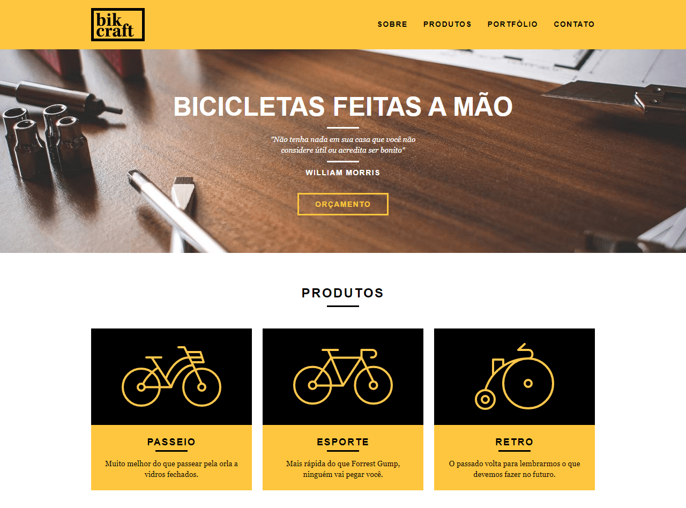
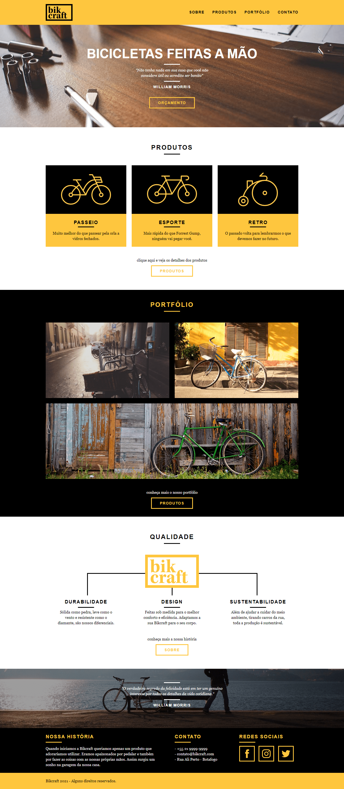

 

# **[Bikcraft](https://ranyery.github.io/bikcraft-origamid/)** 🚴‍♀️
Bikcraft é uma empresa fictícia que vende bicicletas personalizadas. O projeto foi desenvolvido durante o curso [Web Design Completo da Origamid](https://www.origamid.com/curso/web-design-completo/). O site institucional é responsivo e se adapta ao formato de diversos dispositivos e tamanhos de tela, sem distorções ou perdas de informação. **[Clique aqui para acessar](https://ranyery.github.io/bikcraft-origamid/)**.
  
## ❤ Tecnologias
- HTML5
- CSS3
- JavaScript
  
## 🖥️ Prévia
 
Clique [aqui](https://ranyery.github.io/bikcraft-origamid/) para acessar o projeto.
  
## 🛠 Como executar o projeto
- Clone o repositório com o comando `git clone` ou faça o [download](https://github.com/ranyery/bikcraft-origamid/archive/refs/heads/main.zip).
- Acesse o diretório com o comando `cd bikcraft-origamid`.
- Utilize o [Live Server](https://marketplace.visualstudio.com/items?itemName=ritwickdey.LiveServer) para criar um servidor local e executar o projeto.
  
## ☕ Entre em contato
- [LinkedIn](https://www.linkedin.com/in/ranyery/)
- [Instagram](https://www.instagram.com/ranyeryfx)
- [Youtube](https://www.youtube.com/channel/UCEeOZsBawGWSUieDaMQsDww)
  
---
Alguns direitos reservados à Origamid 🐺
